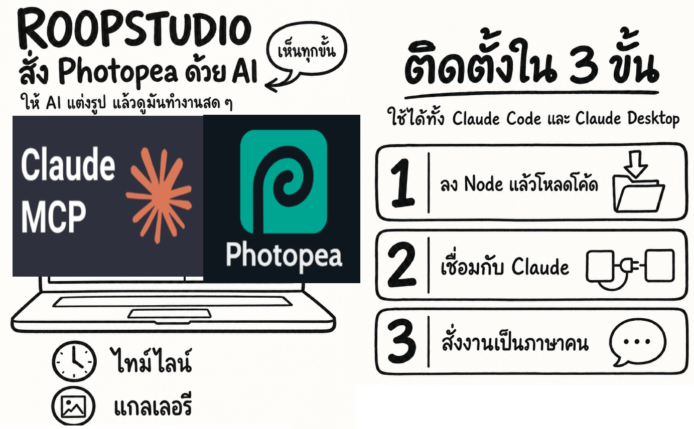
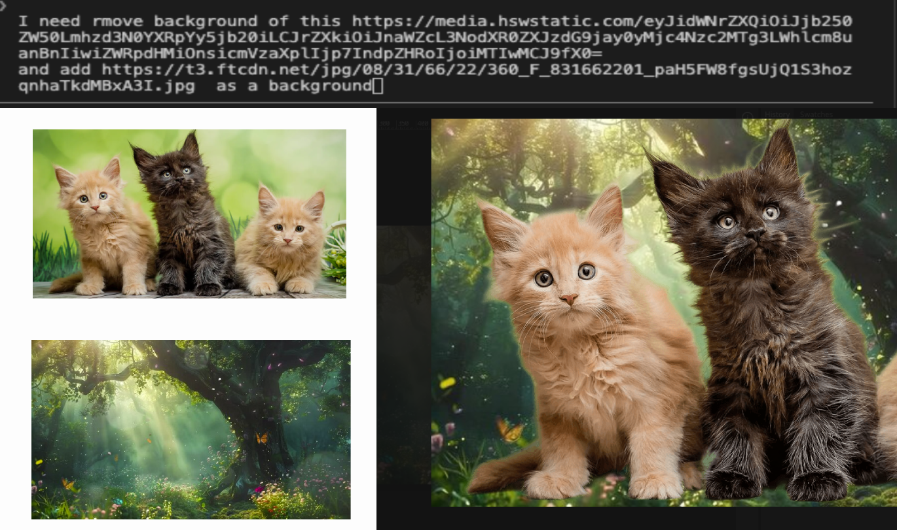
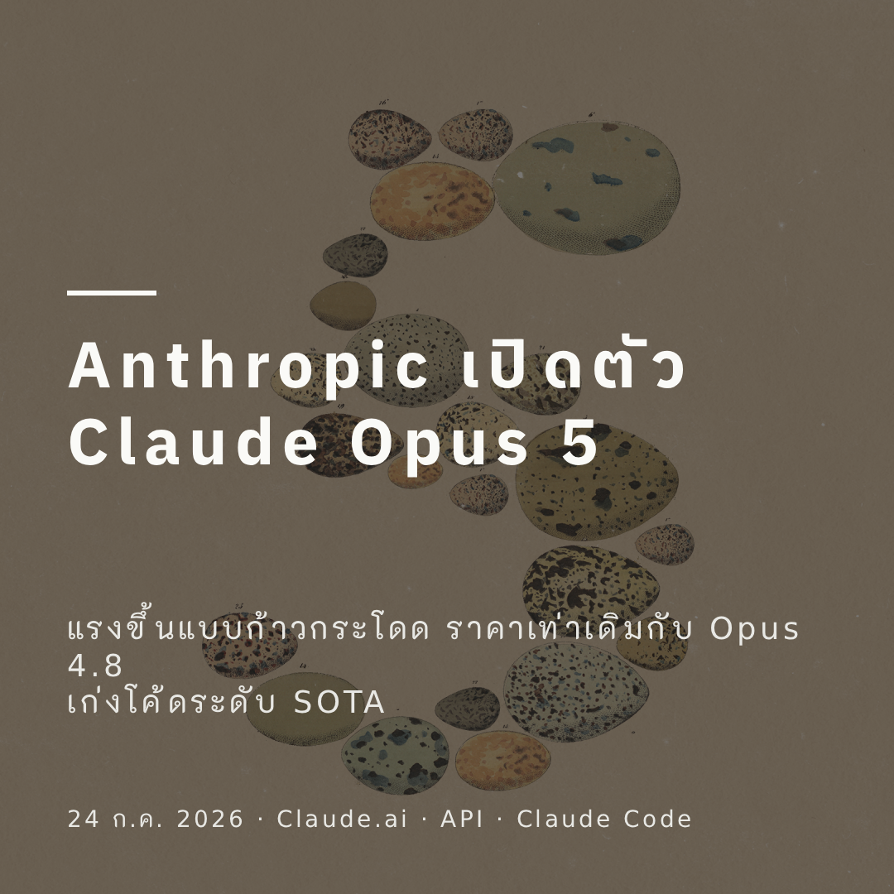

# RoopStudio (รูปสตูดิโอ)

MCP server ที่ให้ AI สั่ง **Photopea** (Photoshop ในเบราว์เซอร์ ใช้ฟรี) แต่งรูปให้ —
พร้อม **หน้า Studio ที่เห็นทุกขั้นที่ AI ทำ และกดทำเองได้ด้วย**



> **คู่มือใช้งานเต็ม + ตัวอย่างสั่งงานจริง + วิธีต่อกับ Claude Code / Claude Desktop:
> [USAGE.md](USAGE.md)**

## ติดตั้ง

```bash
pnpm install          # ต้องมี Node >= 18
```

ต่อกับ **Claude Code** (คำสั่งเดียวจบ):

```bash
claude mcp add --scope user roopstudio -- node "/path/to/roopstudio/app/src/index.js"
claude mcp list        # ควรขึ้น  ✔ Connected: roopstudio
```

ต่อกับ **Claude Desktop** — แก้ `claude_desktop_config.json`
(macOS: `~/Library/Application Support/Claude/`, Windows: `%APPDATA%\Claude\`)
แล้วปิด-เปิดแอปใหม่:

```json
{
  "mcpServers": {
    "roopstudio": { "command": "node", "args": ["/path/to/roopstudio/app/src/index.js"] }
  }
}
```

แล้วสั่งเป็นภาษาคนได้เลย เช่น
*"ทำภาพปกโพสต์ พาดหัวว่า 'โค้ดเสร็จแล้วแต่ไปต่อไม่เป็น' ใส่รูป ~/Desktop/bg.jpg เป็นพื้นหลัง เอาทุกขนาด เซฟลง ~/Desktop/covers"*

เบราว์เซอร์จะเปิดหน้า Studio ให้เองตอนมีคำสั่งแรก — ดูมันทำงานสด ๆ ได้ที่นั่น

### ลองแบบไม่ต้องมี AI

```bash
pnpm mock     # Photopea จำลอง (ออฟไลน์) + MCP
pnpm ui       # เปิดหน้า Studio อย่างเดียว ไม่เริ่ม MCP
node src/index.js            # ของจริง: Photopea จริง + MCP
node src/index.js --port 5000
```

## ฟีเจอร์เด่น

- **งานสำเร็จรูปครบในคำสั่งเดียว** — ทำภาพปกโพสต์ทุกขนาดพร้อมพาดหัวไทย หรือ export
  ภาพเดียวเป็นหลายขนาดโซเชียล ไม่ต้องสั่งเป็นสิบขั้น
- **ตัดพื้นหลังด้วย AI ที่รันในเครื่อง** — matting จริง ขอบขนสัตว์/เส้นผมฟุ้งได้ตามภาพจริง
  ไม่ใช่แค่ตัดตามสี ประมวลผลทั้งหมดในเครื่อง ไม่ผ่าน API ภายนอก
- **จัดการเลเยอร์และใส่เอฟเฟกต์** — list/add/duplicate/reorder/blend mode/opacity
  และ filter มาตรฐาน (blur, sharpen, noise ฯลฯ) — `roop_layer` action `list` บอก bounds
  (ตำแหน่ง/ขนาดจริงเป็นพิกเซล) ของทุกเลเยอร์ให้ด้วย ไม่ต้องกะเอง
- **หาตำแหน่งตัวแบบอัตโนมัติ** — `roop_detect_subject` ใช้โมเดล AI ตัวเดียวกับตัดพื้นหลัง
  หา bounding box ของคน/วัตถุหลักในรูป ช่วยจัดองค์ประกอบ/ครอป/วางข้อความหลบตัวแบบได้แม่นยำ
- **นำเข้าหลายรูปเป็นเลเยอร์ + export .psd** — `roop_import_layers` รวมรูปหลายไฟล์เป็น
  เอกสารหลายชั้นในคำสั่งเดียว แล้ว `roop_export` เป็น `.psd` เก็บเลเยอร์ไว้ครบ เปิดต่อใน
  Photoshop/Photopea ได้ตรง ๆ
- **รองรับภาษาไทยเต็มรูปแบบ แต่ฉลาดพอจะไม่โหลดถ้าไม่จำเป็น** — ตรวจข้อความอัตโนมัติ
  ถ้ามีอักษรไทยจะโหลดฟอนต์ไทยให้เอง ถ้าเป็นอังกฤษ/ละตินล้วนใช้ฟอนต์ระบบเฉย ๆ ไม่ต้องต่อเน็ต
- **หน้า Studio แบบเห็นสด** — ไทม์ไลน์งานที่ AI ทำ, แกลเลอรีรูปที่ export, ปุ่มลัดกดเอง
  โดยไม่ชนกับคิวงานของ AI
- **export หลายไฟล์ในคำสั่งเดียว** — เช่นทำครบทุกขนาดโซเชียลในรอบเดียว ไม่ต้องเรียกซ้ำ

## ตัวอย่างผลลัพธ์

**ตัดแมวออกจากพื้นหลังเดิม แล้ววางบนพื้นหลังป่าใหม่** — ให้รูป 2 ใบ (แมว + พื้นหลัง)
สั่งประโยคเดียว: *"remove background of this [รูปแมว] and add [รูปป่า] as a background"*



**ทำภาพปกโพสต์ Facebook จากข่าวจริง** — ให้ลิงก์ข่าว สั่ง *"ทำโพส facebook ภาษาไทยสำหรับ
เนื้อหานี้ โหลดรูปจากเน็ตได้ ใช้ Photopea mcp"* — AI อ่านเนื้อหาข่าว ดึงรูปปกจากหน้านั้นเอง
แล้วจัดหน้า + ใส่พาดหัวไทยให้ครบ



## Tools

**งานสำเร็จรูป** — `roop_make_post_cover` (ภาพปกโพสต์ทุกขนาด จัดหน้าใหม่ต่อขนาด
ตัวหนังสือจึงไม่โดนครอป), `roop_export_social_set` (ภาพเดียว → หลายขนาด ครอปกลาง),
`roop_remove_background` (ตัดพื้นหลังด้วย AI ในคำสั่งเดียว — ดูหัวข้อด้านล่าง),
`roop_detect_subject` (หา bounding box ของตัวแบบอัตโนมัติด้วย AI — ดูหัวข้อด้านล่าง),
`roop_import_layers` (รวมหลายรูปเป็นเอกสารหลายเลเยอร์ในคำสั่งเดียว เพื่อ export เป็น `.psd`)

**เลเยอร์ / เอฟเฟกต์** — `roop_layer` (list/add/duplicate/rename/delete/select/reorder/set
opacity-blendMode-visible-lock ของเลเยอร์ — ระบุ `action`, action `list` มี bounds ของแต่ละ
เลเยอร์ด้วย), `roop_filter`
(gaussianBlur/sharpen/sharpenMore/unsharpMask/addNoise/motionBlur/highPass/despeckle
บนเลเยอร์ที่กำลังเลือกอยู่)

**Selection** — `roop_select` (rect/ellipse/polygon/all), `roop_magic_wand`
(เลือกตามสีใกล้เคียง เหมาะกับพื้นหลังสีล้วน), `roop_modify_selection`
(expand/contract/feather/invert), `roop_fill_selection`, `roop_erase_selection`,
`roop_deselect`

**ชิ้นส่วนอื่น** — `roop_status`, `roop_create_document`, `roop_document_info`,
`roop_open_image`, `roop_place_image`, `roop_add_text` (auto-detect ฟอนต์ไทย/อังกฤษ),
`roop_add_rect`, `roop_adjust`, `roop_resize`, `roop_export` (รองรับ `.psd` หลายเลเยอร์),
`roop_load_thai_fonts`, `roop_list_fonts`, `roop_undo`, `roop_run_script`

## ตัดพื้นหลังด้วย AI (`roop_remove_background`)

`roop_magic_wand` ใช้ได้ดีเฉพาะพื้นหลังสีล้วน/ใกล้เคียงกัน (เช่นฉากสตูดิโอ) —
พื้นหลังซับซ้อนอย่างท้องฟ้า กิ่งไม้ หรือฉากเปิด ต้องนั่งลากหลายเหลี่ยมเอง ได้ขอบไม่เนียน
`roop_remove_background` แก้ปัญหานี้ด้วยโมเดล AI (ผ่าน [`@imgly/background-removal-node`](https://github.com/imgly/background-removal-js),
ONNX รันบน `onnxruntime-node`) ทำ **matting จริง** — ขอบขนสัตว์/เส้นผมฟุ้งได้ตามภาพจริง
ไม่ใช่แค่ threshold สี

- ไม่ระบุ `source` → ตัดเอกสารที่เปิดอยู่ตอนนี้ แล้วแทนที่เลเยอร์เดิมด้วยผลลัพธ์
  (ชื่อ/ขนาดเอกสารเดิม พร้อม export ต่อได้เลย)
- ระบุ `source` (พาธไฟล์/URL) → เปิดรูปนั้นเป็นเอกสารใหม่ที่ตัดพื้นหลังแล้ว
- เลือกขนาดโมเดลด้วย `model`: `small` (เร็วกว่า/หยาบกว่าเล็กน้อย) หรือ `medium` (ค่าเริ่มต้น)

**ครั้งแรกที่เรียกต้องต่อเน็ต** เพื่อดาวน์โหลดน้ำหนักโมเดล (แคชไว้ในเครื่องอัตโนมัติ)
หลังจากนั้นรันได้แบบออฟไลน์ทั้งหมด — ไฟล์ภาพไม่ถูกส่งออกไปที่ไหนเลย ประมวลผลในเครื่องล้วน ๆ

ติดตั้งครั้งแรกอาจต้องคอมไพล์/ดาวน์โหลด native binary ของ `sharp` และ `onnxruntime-node`
— `pnpm-workspace.yaml` อนุมัติ build script ของสองแพ็กเกจนี้ไว้ล่วงหน้าแล้ว (`allowBuilds`)
ถ้าใช้ npm/yarn แทน pnpm อาจต้องอนุมัติ postinstall เอง

## หาตำแหน่งตัวแบบอัตโนมัติ (`roop_detect_subject`)

ใช้โมเดล AI ตัวเดียวกับ `roop_remove_background` หามวลพิกเซลของตัวแบบหลัก แล้วคืนกรอบ
`{ x, y, width, height, imageWidth, imageHeight }` เป็นพิกเซล — เอาไปคำนวณตำแหน่งวางข้อความ/
ครอป/จัดองค์ประกอบต่อได้ทันที โดยไม่ต้องกะพิกัดจากภาพเอง (จุดอ่อนเดิมตอนทำ selection ด้วยมือ)
ไม่ระบุ `source` = ตรวจเอกสารที่เปิดอยู่ตอนนี้ (เป็น read-only ไม่แก้ไขเอกสาร)

## นำเข้าหลายรูปเป็น .psd หลายเลเยอร์ (`roop_import_layers`)

ให้ลิสต์รูป (`sources`) จะนำเข้าเป็นเอกสารเดียวกันคนละเลเยอร์ตามลำดับ — ถ้ายังไม่มีเอกสาร
เปิดอยู่จะเปิดรูปแรกเป็นเอกสารใหม่ให้เอง (ขนาดเท่ารูปแรก) จากนั้น `roop_export` ด้วย
`format: psd` จะได้ไฟล์ Photoshop หลายเลเยอร์ตรง ๆ เปิดต่อใน Photoshop/Photopea ได้เลย
(เปิดไฟล์ `.psd` กลับเข้ามาก็ใช้ `roop_open_image` ตามปกติ — Photopea อ่าน `.psd` ได้เอง)

## License

MIT
